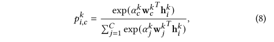
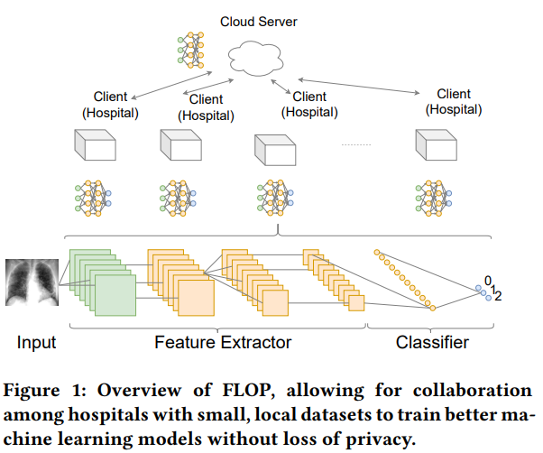
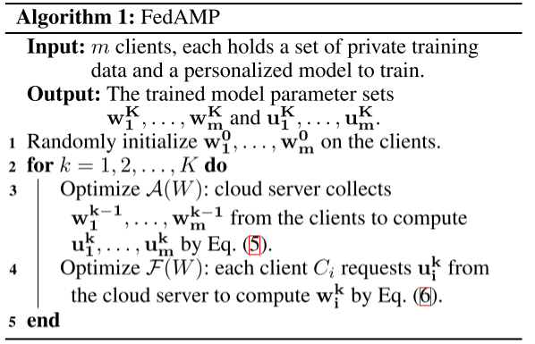
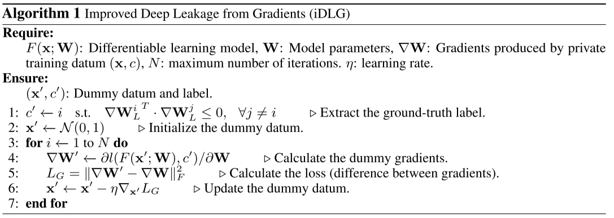

# Paper Reading List

## 2022-02

### Federated Multi-Task Learning [[pdf](https://arxiv.org/pdf/1705.10467.pdf)]

> Personalization, Multi-Task Learning
> 

Propose a systems-aware optimization framework for federated multi-task learning called MOCHA, which consider issues of high communication cost, stragglers, and fault tolerance.

### CAFE: Catastrophic Data Leakage in Vertical Federated Learning [[pdf](https://papers.nips.cc/paper/2021/file/08040837089cdf46631a10aca5258e16-Paper.pdf)]

> Security
NIPS2021
> 

Propose a method called catastrophic data leakage in vertical federated learning (CAFE) to perform large-batch data leakage with high data recovery quality and theoretical guarantees.

Also, propose fake gradients to mitigate the risk of CAFE.

### Sageflow: Robust Federated Learning against Both Stragglers and Adversaries [[pdf](https://papers.nips.cc/paper/2021/file/076a8133735eb5d7552dc195b125a454-Paper.pdf)]

> Security, Stragglers
NIPS2021
> 

Propose Sageflow, staleness-aware grouping with entropy-based filtering and loss-weighted averaging, to handle both stragglers and adversaries **simultaneously.**

### Federated Learning for Non-IID Data via Unified Feature Learning and Optimization Objective Alignment [[pdf](https://openaccess.thecvf.com/content/ICCV2021/papers/Zhang_Federated_Learning_for_Non-IID_Data_via_Unified_Feature_Learning_and_ICCV_2021_paper.pdf)]

> Heterogeneous 
ICCV2021
> 

Propose a framework called Unified Feature learning and Optimization objectives alignment method (FedUFO) for non-IID FL.

- adversary module: reduce the divergence on feature representation among different clients
- two consensus losses:  reduce the inconsistency on optimization objectives from two perspectives

### Federated Adversarial Debiasing for Fair and Transferable Representations [[pdf](https://dl.acm.org/doi/abs/10.1145/3447548.3467281)]

> Heterogeneous 
KDD2021
> 

Propose a framework called **F**ederated **A**dversarial **DE**biasing (FADE), which preserves the user privacy and allows user to freely opt-in/out the learning of the adversarial component.

FADE is the first to study the properties of adversarial learning in the federated setting.

### FedRS: Federated Learning with Restricted Softmax for Label Distribution Non-IID Data [[pdf](https://dl.acm.org/doi/abs/10.1145/3447548.3467254)]

> Heterogeneous 
KDD2021
> 

Study the label distribution non-iid challenge in FL and in-depth analyze the most vulnerable layer, i.e., softmax classification layer in deep networks.

Advocate the classification weights of missing classes should be updated carefully during local procedure.

Propose Restricted Softmax and FedRS to obtain a more accurate aggregation:

  

### FLOP: Federated Learning on Medical Datasets using Partial Networks [[pdf](https://arxiv.org/pdf/2102.05218.pdf)]

> Application
KDD2021
> 

Introduce a framework called **F**ederated **L**earning **o**n Medical Datasets using **P**artial Networks (FLOP)

  

### Fed2: Feature-Aligned Federated Learning [[pdf](https://arxiv.org/pdf/2111.14248.pdf)]

> KDD2021

solve the weight divergence problem

### FedBoost: Communication-Efficient Algorithms for Federated Learning [[pdf](http://proceedings.mlr.press/v119/hamer20a/hamer20a.pdf)]

> Communication
ICML2020
> 

**Question:** 

Can we learn very large models in federated learning that may not fit in client devices’ memory?

**Solution:**

Introduce a communication-efficiency method, FedBoost, to tackle the server-to-client communication problem.

FedBoost incorporate **ensemble methods** to optimize density estimation.

### No Fear of Heterogeneity: Classifier Calibration for Federated Learning with Non-IID Data [[pdf](https://papers.neurips.cc/paper/2021/file/2f2b265625d76a6704b08093c652fd79-Paper.pdf)]

> Heterogeneous 
NIPS2021
> 

The **first** to decouple the representation and classifier in federated learning.

**Issue**: how the data heterogeneity affects each layer of a deep classification model?

**Observations:**

- there exists a greater bias in the classifier than other layers
- the classification performance can be significantly improved by post-calibrating the classifier after federated training

**Solution:** propose a algorithm called Classifier Calibration with Virtual Representations (CCVR), which adjusts the classifier using virtual representations sampled from an approximated gaussian mixture model.

For federated models trained on non-IID data, the deeper layers have heavier heterogeneity across different clients

**Limitations**:

- it can only serve as an experimental study use but cannot be applied to the real federated learning system
- only focus on image classification task (CNN) in this paper

### Personalized Cross-Silo Federated Learning on Non-IID Data [[pdf](https://arxiv.org/pdf/2007.03797.pdf)]

> Personalization

Introduce FedAMP and HeurFedAMP  to tackle the problem of personalized cross-silo federated learning.

FedAMP and HeurFedAMP use attentive message passing mechanism to facilitate the collaboration effectiveness between clients without infringing their data privacy.

  

### A Secure Federated Transfer Learning Framework [[pdf](https://arxiv.org/pdf/1812.03337.pdf)]

> FTL

The first framework to enable federated learning to benefit from transfer learning.

- HE-based FTL
    
    simple, but computationally expensive
    
- Secret Sharing based FTL
    
    no accuracy loss, computation is faster, but has to offline generate and store many triplets before online computation

### iDLG: Improved Deep Leakage from Gradients [[pdf](https://arxiv.org/pdf/2001.02610.pdf)]

> Security
> 

**Requirements** of iDLG: differentiable model trained with cross-entropy loss over one-hot labels

Contributions:

- Reveal the relationship between labels and signs of gradients:
    
    the gradient of the classification (cross-entropy) loss w.r.t. the correct label activation (in the output layer) lies in (−1, 0), while those
    of other labels lie in (0, 1)
    
- Present an analytical procedure to extract the ground-truth labels from the shared gradients with 100% accuracy
- Demonstrate the advantages of iDLG over DLG

  

### Deep Leakage from Gradients [[pdf](https://arxiv.org/pdf/1906.08935.pdf)]

> Security

**Requirements** of DLG: differentiable model

**Contributions**:

- Demonstrate that it is possible to obtain the private training data from the shared gradients. And DLG is the first algorithm achieving it.
- DLG only requires the gradients instead of extra information
- Discuss several defense strategies against the attack: Noisy Gradients, Gradient Compression and Sparsification, Large Batch, High Resolution and Cryptology

  

  

### Threats to Federated Learning: A Survey [[pdf](https://arxiv.org/pdf/2003.02133.pdf)]

> Survey, Security

**Threat Models:**

- Insider v.s. Outsider
- Semi-honest v.s. Malicious
- Training Phase v.s. Inference Phase

**Poisoning Attacks:**

- Data Poisoning
    - two categories: clean-label, dity-label
    - examples: label-flipping attack
- Model Poisoning
    - aim to poison local model updates
    - examples: backdoor attack

**Inference Attacks:**

- Inferring Class Representatives: GAN attack
- Inferring Membership: gradient ascent attack
- Inferring Properties: property inference attack
- Inferring Training Inputs and Labels: deep leakage from gradient (DLG), improved DLG (iDLG)

### A survey on security and privacy of federated learning [[pdf](https://www.sciencedirect.com/science/article/pii/S0167739X20329848)]

> Survey, Security

**Background** of Federated Learning:

- three major factor for the success of ML
    
    big data, computational power, deep learning model
    
- two major obstacles for the application of ML:
    
    data privacy and confidentiality, inadequate data and training cost
    
- introduce federated learning to solve the above obstacles
- the application of federated learning:
    
    next word prediction on keyboards, wake word detection
    
    wireless communication, security domain, intelligent transportation industry, computer vision domain, medical domain
    

**Categorization** of FL approaches:

- Network Topology: Centralized & Clustered FL, Fully Decentralized FL
- Data Availability: Cross silo FL, Cross device FL
- Data Partition: HFL, VFL, FTL
- Aggregating / Optimizing Algorithms: Aggregation Algorithm, Communication Cost / Efficiency
- Open-Source Frameworks: TFF, PySyft, FATE, FedML

**Security** in FL:

- Source of vulnerabilities in FL:
    
    Communication Protocol, Client Data Manipulations, Compromised Central Server, Weaker Aggregation Algorithm, Implement of FL Environment
    
- Security attacks in FL:
    
      
    
- Defensive techniques for security vulnerabilities of FL:
    
      

**Privacy** in FL:

- Privacy attacks in FL:
    
    Membership inference attacks, Unintentional data leakage & reconstruction through inference, GANs-based inference attacks
    
- Approaches to enhance privacy preservation in FL:
    
      

- Associated cost with the privacy-preserving techniques
    
    If the FL model preserves more privacy, it loses more accuracy and costs more time to converge. On the contrary, if the FL model needs to preserve a certain degree of accuracy or converge time, it needs to estimate if the privacy protection level is acceptable or not.

### Salvaging Federated Learning by Local Adaptation [[pdf](https://arxiv.org/pdf/2002.04758.pdf)]

> Personalization

**Contributions:**

Does federated learning yield more accurate models for them?

What can they do locally to improve the quality of models they obtain from FL?

1. privacy and robustness protections destroy the accuracy of federated models for many participants, removing their main incentive to join federated learning
2. use local adaptation to convert the federated model into individual models for each participant
3. investigate adaptation mechanisms: fine-tuning, freeze-base, multi-task learning, and knowledge distillation

Tradeoff at the heart of FL:

- To learn a joint model that is accurate for individual participants, aggregation must incorporate contributions from every participant.
- To protect data privacy and model integrity, aggregation must limit the influence of these contributions, producing an inaccurate model

### Federated Evaluation of On-device Personalization [[pdf](https://arxiv.org/pdf/1910.10252.pdf)]

> Personalization

Introduce tools to perform Federated Personalization Evaluation and analyze results in a privacy-preserving manner.

The first evaluation of personalization using privacy-preserving techniques on a large population of live users.

### Survey of Personalization Techniques for Federated Learning [[pdf](https://arxiv.org/pdf/2003.08673.pdf)]

> Survey, Personalization

Personalization of the global model is used to handling the challenges posed by statistical heterogeneity and non-IID distribution of data.

Techniques:

- Adding User Context
- Transfer Learning
- Multi-Task Learning
- Meta-Learning
- Knowledge Distillation
- Base + Personalization Layers
- Mixture of Global and Local Models

### Can You Really Backdoor Federated Learning? [[pdf](https://arxiv.org/pdf/1911.07963.pdf)]

> Security

Study backdoor attacks and defenses for federated learning under EMNIST dataset.

- In the absence of any defense, the performance of the adversary largely depends on the fraction of adversaries present.
- norm clipping limits the success of known backdoor attacks
- adding a small amount of Gaussian noise, in addition to norm clipping, can help further mitigate the effect of adversaries.

### Federated Optimization in Heterogeneous Networks [[pdf](https://arxiv.org/pdf/1812.06127.pdf)]

> Model Aggregation
> 

Introduce FedProx to tackle heterogeneous in federated networks.

The heterogeneous in federated networks:

- System heterogeneous: different size of participants
- Statistical heterogeneous: data is non-iid

FedAvg can’t address the underlying challenges associated with heterogeneity:

- System: FedAvg simply drop devices that fail to complete local updates
- Statistical: FedAvg is difficult to analyze theoretically and lacks convergence guarantees.

FedProx:

- Variable amounts of work to be performed locally across devices based on their available systems resources
- Add a proximal term to objective

  

### PyVertical: A Vertical Federated Learning Framework For Multi-headed SplitNN [[pdf](https://arxiv.org/pdf/2104.00489.pdf)]

> System

Introduce a framework supporting vertical federated learning using split neural network.

### HeteroFL: Computation and Communication Efficient Federated Learning for Heterogeneous Clients [[pdf](https://arxiv.org/pdf/2010.01264.pdf)]

> Heterogeneous

Introduce a framework called HeteroFL to train heterogeneous local models with varying computation complexities and still produce a single global inference model.

The first work to allow local models to have different architectures from the global model.

### How To Backdoor Federated Learning [[pdf](https://arxiv.org/pdf/1807.00459.pdf)]

> Security

Federated learning is generically vulnerable to model poisoning

- it is impossible to ensure that none of millions of participants are malicious

- neither defenses against data poisoning, nor anomaly detection can be used during federated learning
  
  because they require access to the training data or model updates.

### Federated Learning for Keyword Spotting [[pdf](https://arxiv.org/pdf/1810.05512.pdf)]

> application for wake word detectors

This paper introduce Federated Learning method with adaptive averaging strategy into wake word detection task.