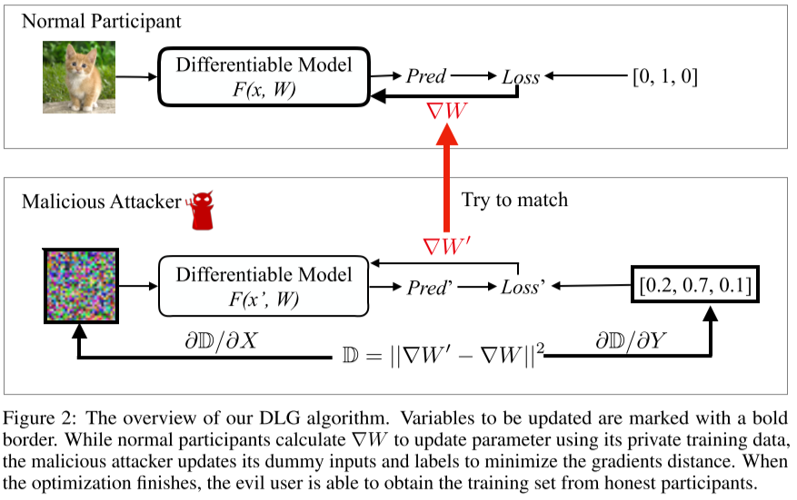
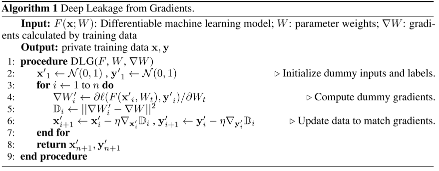
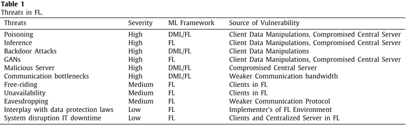
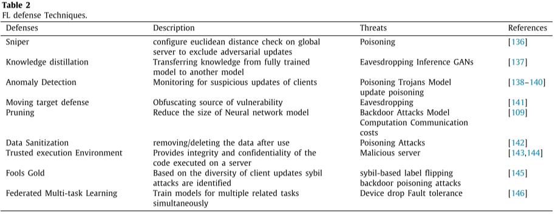
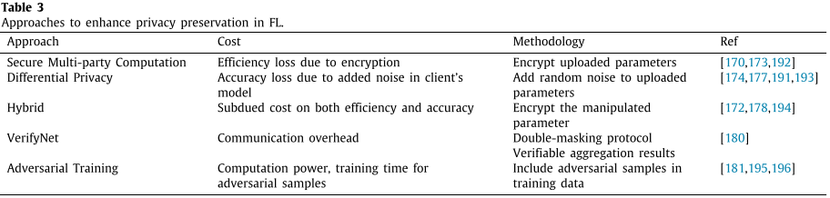
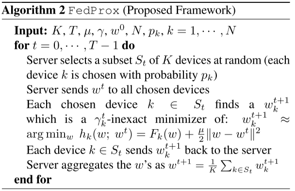
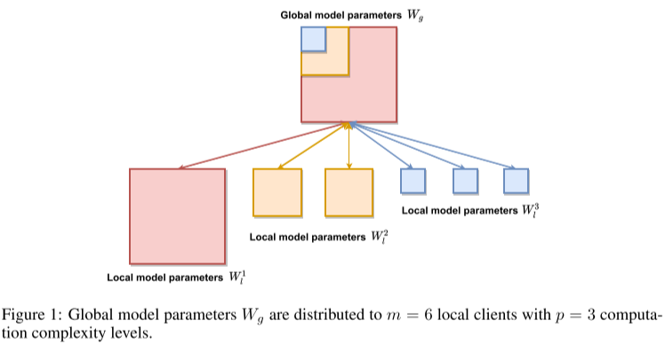
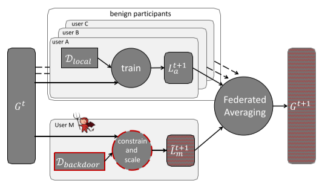

# Paper Reading List

## 2022-02

### Deep Leakage from Gradients [[pdf](https://arxiv.org/pdf/1906.08935.pdf)]

> Security

**Requirements** of DLG: differentiable model

**Contributions**:

- Demonstrate that it is possible to obtain the private training data from the shared gradients. And DLG is the first algorithm achieving it.
- DLG only requires the gradients instead of extra information
- Discuss several defense strategies against the attack: Noisy Gradients, Gradient Compression and Sparsification, Large Batch, High Resolution and Cryptology

  

  

### Threats to Federated Learning: A Survey [[pdf](https://arxiv.org/pdf/2003.02133.pdf)]

> Survey, Security

**Threat Models:**

- Insider v.s. Outsider
- Semi-honest v.s. Malicious
- Training Phase v.s. Inference Phase

**Poisoning Attacks:**

- Data Poisoning
    - two categories: clean-label, dity-label
    - examples: label-flipping attack
- Model Poisoning
    - aim to poison local model updates
    - examples: backdoor attack

**Inference Attacks:**

- Inferring Class Representatives: GAN attack
- Inferring Membership: gradient ascent attack
- Inferring Properties: property inference attack
- Inferring Training Inputs and Labels: deep leakage from gradient (DLG), improved DLG (iDLG)

### A survey on security and privacy of federated learning [[pdf](https://www.sciencedirect.com/science/article/pii/S0167739X20329848)]

> Survey, Security

**Background** of Federated Learning:

- three major factor for the success of ML
    
    big data, computational power, deep learning model
    
- two major obstacles for the application of ML:
    
    data privacy and confidentiality, inadequate data and training cost
    
- introduce federated learning to solve the above obstacles
- the application of federated learning:
    
    next word prediction on keyboards, wake word detection
    
    wireless communication, security domain, intelligent transportation industry, computer vision domain, medical domain
    

**Categorization** of FL approaches:

- Network Topology: Centralized & Clustered FL, Fully Decentralized FL
- Data Availability: Cross silo FL, Cross device FL
- Data Partition: HFL, VFL, FTL
- Aggregating / Optimizing Algorithms: Aggregation Algorithm, Communication Cost / Efficiency
- Open-Source Frameworks: TFF, PySyft, FATE, FedML

**Security** in FL:

- Source of vulnerabilities in FL:
    
    Communication Protocol, Client Data Manipulations, Compromised Central Server, Weaker Aggregation Algorithm, Implement of FL Environment
    
- Security attacks in FL:
    
      
    
- Defensive techniques for security vulnerabilities of FL:
    
      

**Privacy** in FL:

- Privacy attacks in FL:
    
    Membership inference attacks, Unintentional data leakage & reconstruction through inference, GANs-based inference attacks
    
- Approaches to enhance privacy preservation in FL:
    
      

- Associated cost with the privacy-preserving techniques
    
    If the FL model preserves more privacy, it loses more accuracy and costs more time to converge. On the contrary, if the FL model needs to preserve a certain degree of accuracy or converge time, it needs to estimate if the privacy protection level is acceptable or not.

### Salvaging Federated Learning by Local Adaptation [[pdf](https://arxiv.org/pdf/2002.04758.pdf)]

> Personalization

**Contributions:**

Does federated learning yield more accurate models for them?

What can they do locally to improve the quality of models they obtain from FL?

1. privacy and robustness protections destroy the accuracy of federated models for many participants, removing their main incentive to join federated learning
2. use local adaptation to convert the federated model into individual models for each participant
3. investigate adaptation mechanisms: fine-tuning, freeze-base, multi-task learning, and knowledge distillation

Tradeoff at the heart of FL:

- To learn a joint model that is accurate for individual participants, aggregation must incorporate contributions from every participant.
- To protect data privacy and model integrity, aggregation must limit the influence of these contributions, producing an inaccurate model

### Federated Evaluation of On-device Personalization [[pdf](https://arxiv.org/pdf/1910.10252.pdf)]

> Personalization

Introduce tools to perform Federated Personalization Evaluation and analyze results in a privacy-preserving manner.

The first evaluation of personalization using privacy-preserving techniques on a large population of live users.

### Survey of Personalization Techniques for Federated Learning [[pdf](https://arxiv.org/pdf/2003.08673.pdf)]

> Survey, Personalization

Personalization of the global model is used to handling the challenges posed by statistical heterogeneity and non-IID distribution of data.

Techniques:

- Adding User Context
- Transfer Learning
- Multi-Task Learning
- Meta-Learning
- Knowledge Distillation
- Base + Personalization Layers
- Mixture of Global and Local Models

### Can You Really Backdoor Federated Learning? [[pdf](https://arxiv.org/pdf/1911.07963.pdf)]

> Security

Study backdoor attacks and defenses for federated learning under EMNIST dataset.

- In the absence of any defense, the performance of the adversary largely depends on the fraction of adversaries present.
- norm clipping limits the success of known backdoor attacks
- adding a small amount of Gaussian noise, in addition to norm clipping, can help further mitigate the effect of adversaries.

### Federated Optimization in Heterogeneous Networks [[pdf](https://arxiv.org/pdf/1812.06127.pdf)]

> Model Aggregation
> 

Introduce FedProx to tackle heterogeneous in federated networks.

The heterogeneous in federated networks:

- System heterogeneous: different size of participants
- Statistical heterogeneous: data is non-iid

FedAvg can’t address the underlying challenges associated with heterogeneity:

- System: FedAvg simply drop devices that fail to complete local updates
- Statistical: FedAvg is difficult to analyze theoretically and lacks convergence guarantees.

FedProx:

- Variable amounts of work to be performed locally across devices based on their available systems resources
- Add a proximal term to objective

  

### PyVertical: A Vertical Federated Learning Framework For Multi-headed SplitNN [[pdf](https://arxiv.org/pdf/2104.00489.pdf)]

> System

Introduce a framework supporting vertical federated learning using split neural network.

### HeteroFL: Computation and Communication Efficient Federated Learning for Heterogeneous Clients [[pdf](https://arxiv.org/pdf/2010.01264.pdf)]

> Heterogeneous

Introduce a framework called HeteroFL to train heterogeneous local models with varying computation complexities and still produce a single global inference model.

The first work to allow local models to have different architectures from the global model.

### How To Backdoor Federated Learning [[pdf](https://arxiv.org/pdf/1807.00459.pdf)]

> Security

Federated learning is generically vulnerable to model poisoning

- it is impossible to ensure that none of millions of participants are malicious

- neither defenses against data poisoning, nor anomaly detection can be used during federated learning
  
  because they require access to the training data or model updates.

### Federated Learning for Keyword Spotting [[pdf](https://arxiv.org/pdf/1810.05512.pdf)]

> application for wake word detectors

This paper introduce Federated Learning method with adaptive averaging strategy into wake word detection task.